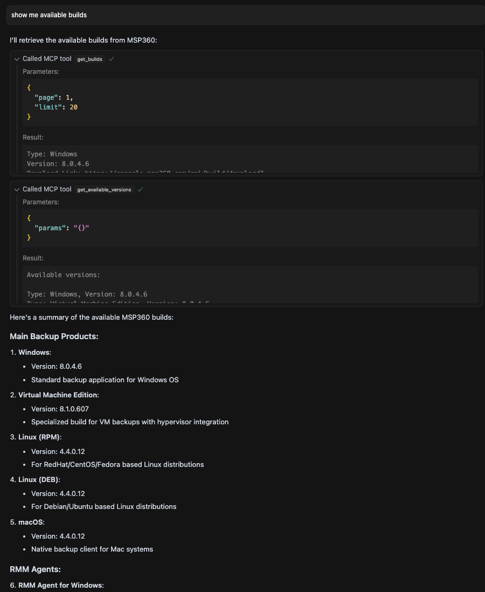

# MSP360/CloudBerry MCP Server

MCP server for MSP360/CloudBerry API.

## Features

- FastAPI-based RESTful API for MSP360/CloudBerry
- Endpoints for users, packages, companies, and backup operations
- Docker-based MCP server integration with Cursor IDE

## Requirements

- Docker
- Cursor IDE


## Example



## Getting Started

1. **Pull the Docker image**

```bash
docker pull tonyzorin/msp360-mcp:latest
```

## Using with Cursor (MCP)

### Configuration

**For global settings update:**

```
/Users/%username%/.cursor/mcp.json
```

**For a specific project update:**
```
%project_root%/.cursor/mcp.json
```

An example configuration file is provided in the repository as `mcp.json.example`. You can copy this file to your Cursor configuration location and update it with your API credentials:

```json
{
  "mcpServers": {
    "MSP360": {
      "command": "docker",
      "args": [
        "run",
        "-i",
        "--rm",
        "-e", "MSP360_API_LOGIN=<YOUR_API_LOGIN>",
        "-e", "MSP360_API_PASSWORD=<YOUR_API_PASSWORD>",
        "-e", "API_TIMEOUT=60",
        "tonyzorin/msp360-mcp:latest",
        
      ]
    }
  }
}
```

## Claude Desktop

1. Open Claude Desktop
2. Click on Settings
3. Developer tab -> Edit Config
4. Add MCP server to you claude_desktop.config.json 


```json
{
  "mcpServers": {
    "MSP360": {
      "command": "docker",
      "args": [
        "run",
        "-i",
        "--rm",
        "-e", "MSP360_API_LOGIN=<YOUR_API_LOGIN>",
        "-e", "MSP360_API_PASSWORD=<YOUR_API_PASSWORD>",
        "-e", "API_TIMEOUT=60",
        "tonyzorin/msp360-mcp:latest",
        
      ]
    }
  }
}
```

## Alternative approach


**Clone the repository**

```bash
git clone https://github.com/tonyzorin/msp360-mcp.git
cd msp360-mcp
docker build -t tonyzorin/msp360-mcp:1.0.0 .
```


# MSP360 MCP Tools Documentation

This document provides a comprehensive list of all available Model Context Protocol (MCP) tools for interacting with the MSP360/CloudBerry API.

## User Management Tools

| Tool | Description | Parameters |
|------|-------------|------------|
| `get_users` | Retrieve a list of MSP360 users with optional filtering | `params`: JSON string with filter parameters (page, limit, company_id) |
| `get_user` | Get detailed information about a specific user | `user_id`: ID of the user to retrieve |
| `get_user_monitoring` | Get monitoring data for a specific user's backup/restore plans | `user_id`: ID of the user, `page`: Page number (default: 1), `limit`: Items per page (default: 10) |
| `get_user_destinations` | Get storage destinations configured for a specific user | `user_email`: Email address of the user |
| `get_user_computers` | Get computers/endpoints associated with a specific user | `user_id`: ID of the user |

## Company Management Tools

| Tool | Description | Parameters |
|------|-------------|------------|
| `get_companies` | Retrieve a list of companies with optional filtering | `params`: JSON string with filter parameters (page, limit, name) |
| `get_company` | Get detailed information about a specific company | `company_id`: ID of the company to retrieve |
| `get_company_usage_report` | Generate a storage usage report by company | `page`: Page number (default: 1), `limit`: Items per page (default: 100) |

## Package Management Tools

| Tool | Description | Parameters |
|------|-------------|------------|
| `get_packages` | Get a list of software packages with optional filtering | `params`: JSON string with filter parameters |
| `get_package` | Get detailed information about a specific software package | `package_id`: ID of the package to retrieve |

## Monitoring & Reporting Tools

| Tool | Description | Parameters |
|------|-------------|------------|
| `get_monitoring_data` | Get monitoring data for backup/restore plans | `params`: JSON string with filter parameters (page, limit, user_id, company_id, from_date, to_date, status) |
| `get_monitoring_item` | Get detailed information about a specific monitoring item | `item_id`: ID of the monitoring item to retrieve |
| `get_detailed_report` | Get a detailed report from a DetailedReportLink URL | `report_url`: The DetailedReportLink URL to access |
| `get_backup_summary_report` | Generate a summary report of backup activities | `days`: Number of days to include (default: 7), `company_id`: Optional company filter, `include_successful`: Include successful backups (default: true), `include_warnings`: Include warning backups (default: true), `include_errors`: Include failed backups (default: true) |

## Account Management Tools

| Tool | Description | Parameters |
|------|-------------|------------|
| `get_accounts` | Get a list of accounts with optional filtering | `params`: JSON string with filter parameters |
| `get_account` | Get detailed information about a specific account | `account_id`: ID of the account to retrieve |
| `create_account` | Create a new MSP360 account | `account_data`: JSON string with account details |
| `update_account` | Update an existing MSP360 account | `account_data`: JSON string with updated account details |

## Storage Destination Tools

| Tool | Description | Parameters |
|------|-------------|------------|
| `add_user_destination` | Add a storage destination to a user | `destination_data`: JSON string with destination details |
| `edit_user_destination` | Edit an existing user storage destination | `destination_data`: JSON string with updated destination details |
| `delete_user_destination` | Delete a user's storage destination | `destination_id`: ID of the destination to delete |

## Computer/Endpoint Management Tools

| Tool | Description | Parameters |
|------|-------------|------------|
| `get_computers` | Get a list of managed computers/endpoints | `params`: JSON string with filter parameters |
| `get_computer` | Get detailed information about a specific computer | `hid`: Hardware ID of the computer |
| `get_computer_disks` | Get information about the disks of a specific computer | `hid`: Hardware ID of the computer |
| `get_computer_plans` | Get backup/restore plans of a specific computer | `hid`: Hardware ID of the computer |
| `remove_computer_authorization` | Remove authorization from a computer | `hid`: Hardware ID of the computer |
| `update_computer_authorization` | Create/update authorization for a computer | `hid`: Hardware ID, `auth_data`: JSON string with authorization details |

## Billing Tools

| Tool | Description | Parameters |
|------|-------------|------------|
| `get_billing` | Get billing information for the current month | `params`: JSON string with filter parameters |
| `get_filtered_billing` | Get filtered billing records | `params`: JSON string with filter parameters |
| `get_billing_details` | Get detailed billing information for backup/restore operations | `details_data`: JSON string with billing detail filters |

## Build Management Tools

| Tool | Description | Parameters |
|------|-------------|------------|
| `get_builds` | Get a list of builds available to users | `page`: Page number (default: 1), `limit`: Items per page (default: 10), `edition`: Optional filter by software edition |
| `get_available_versions` | Get the latest available versions of builds | `params`: Filter parameters (optional) |
| `request_custom_builds` | Request custom builds with specified editions | `build_data`: JSON string with build specifications |

## License Management Tools

| Tool | Description | Parameters |
|------|-------------|------------|
| `get_licenses` | Get a list of licenses with optional filtering | `params`: JSON string with filter parameters |
| `get_license` | Get detailed information about a specific license | `license_id`: ID of the license to retrieve |
| `grant_license` | Grant a license to a user | `license_data`: JSON string with license and user information |
| `release_license` | Release a license from a user | `license_data`: JSON string with license information |
| `revoke_license` | Revoke a license from a user | `license_data`: JSON string with license information |

## Administrator Management Tools

| Tool | Description | Parameters |
|------|-------------|------------|
| `get_admins` | Get a list of administrators with optional filtering | `params`: JSON string with filter parameters (page, limit, name) |
| `get_admin` | Get detailed information about a specific administrator | `admin_id`: ID of the administrator to retrieve |
| `create_admin` | Create a new administrator | `admin_data`: JSON string with administrator details |
| `update_admin` | Update an existing administrator | `admin_data`: JSON string with updated administrator details |
| `delete_admin` | Delete an administrator | `admin_id`: ID of the administrator to delete |

## Usage Examples

### Retrieving Companies

```json
{
  "method": "tools/call",
  "params": {
    "name": "get_companies",
    "arguments": {
      "params": "{\"limit\": 10}"
    }
  },
  "jsonrpc": "2.0",
  "id": 1
}
```

### Getting Monitoring Data

```json
{
  "method": "tools/call",
  "params": {
    "name": "get_monitoring_data",
    "arguments": {
      "params": "{\"limit\": 20, \"status\": \"Error\"}"
    }
  },
  "jsonrpc": "2.0",
  "id": 2
}
```

### Getting User Details

```json
{
  "method": "tools/call",
  "params": {
    "name": "get_user",
    "arguments": {
      "user_id": "12345678-1234-1234-1234-123456789abc"
    }
  },
  "jsonrpc": "2.0",
  "id": 3
}
```

## Response Format

All tools return data in a standard format that's compatible with the Model Context Protocol. Responses will generally have this structure:

```json
{
  "jsonrpc": "2.0",
  "id": 1,
  "result": {
    "content": [
      {
        "type": "text",
        "text": "..."
      },
      {
        "type": "json",
        "json": {...}
      }
    ]
  }
}
```


Common error codes:
- `-32600`: Invalid Request
- `-32601`: Method not found
- `-32602`: Invalid params
- `-32603`: Internal error 

## Contributing

Contributions are welcome! Please feel free to submit a Pull Request.

## License

This project is licensed under the MIT License - see the [LICENSE](LICENSE) file for details.
